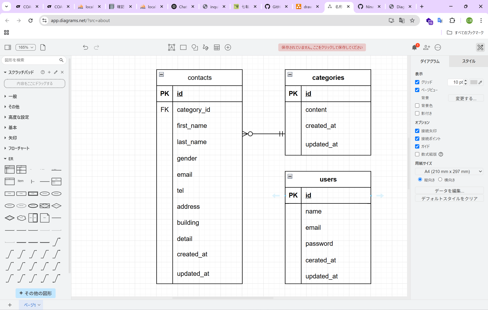

# 20250508-test-contact-form

## お問い合わせフォーム
    お問い合わせの送信。登録済みユーザーによるお問い合わせの管理が可能です。

## 環境構築

### Dockerビルド

1. git clone　git@github.com:NinaFujimori/20250508-test-contact-form.git
2. docker-compose up -d --build

    *MySQLはOSによって起動しない場合があるのでそれぞれのPCに合わせてdocker-compose.ymlファイルを編集してください。

### Laravel環境構築

1. docker-compose exec php bash
2. composer install
3. .env.exampleファイルから.envファイルを作成し、環境変数を変更
4. php artisan key:generate
5. php artisan migrate
6. php artisan db:seed

## 使用技術
    ・PHP8.0
    ・Laravel 10.0
    ・MySQL 8.0

## ER図

## URL
    ・環境開発:http://localhost
    ・phpMyAdmin:http://localhost:8080/

